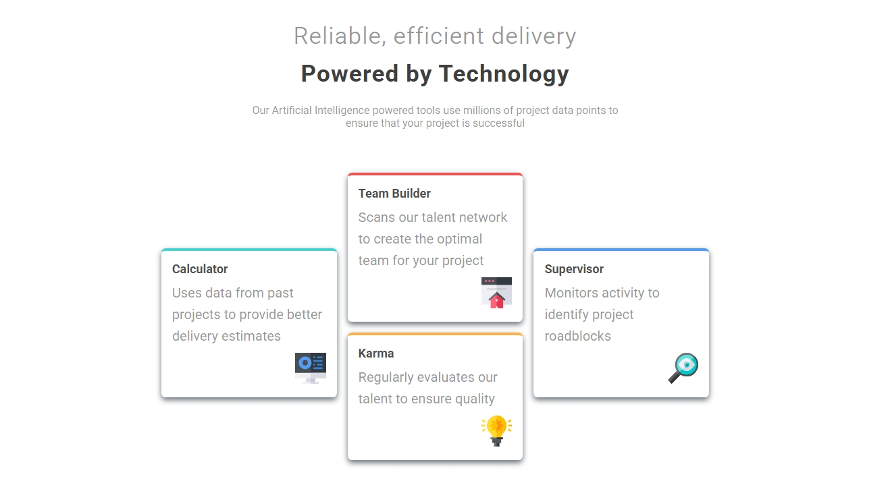

Hello this is simple page based on frotend mentor challenge .

it's designed to help practice my coding skill and experience new features while building realistic projects.

## technology
this paged is built with pure HTML5 and CSS3 .
using sementic html element and css styling best practce. 

## FEATURES

-- css flex-box and grid
--sementic html element 
--css media query for responsiveness and more.

## WHAT I LEARNED

this  helped me to practice something new called container query and more about the mobile first approach.

# here is the link to my project.
  https://josaphat-balyathire.github.io/four-card-features/

# screen short

